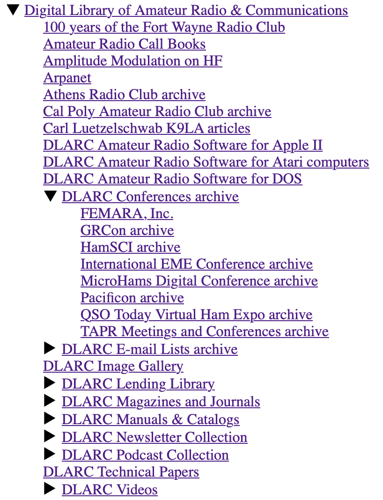

# InternetArchive-xtree
Builds a tree view of an Internet Archive collection's sub-collections

An Internet Archive [collection](https://help.archive.org/help/collections-a-basic-guide/) may have any number of sub-collections (and even sub-sub-collections.) It can be tricky to maintain or explore collections with many sub-collections. InternetArchive-xtree creates a tree of all the sub-collections under a collection. Output can be text or HTML.

**Requirements:** the [ia command line tool](https://archive.org/developers/quick-start-cli.html) and and [GNU Parallel](https://opensource.com/article/18/5/gnu-parallel).

**Sample Output**
Text mode: built with ./xtree collection-identifier

    %./xtree.sh dlarc
    Digital Library of Amateur Radio & Communications (dlarc)
      |100 years of the Fort Wayne Radio Club (fortwayneradioclub)
      |Cal Poly Amateur Radio Club archive (cal-poly-amateur-radio)
      |DLARC Conferences archive (dlarc-conferences)
        |FEMARA, Inc. (femarainc)
        |GRCon archive (grcon)
        |HamSCI archive (hamsci)
        |International EME Conference archive (eme_conference)
        |MicroHams Digital Conference archive (microhams)
        |Pacificon archive (pacificon)
        |QSO Today Virtual Ham Expo archive (qso-today)
        |TAPR Meetings and Conferences archive (tapr-meetings)
      |DLARC E-mail Lists archive (dlarc-email)
        |BOATANCHORS Digest archive (boatanchors)
        |GLOWBUGS Digest archive (glowbugs)
        |Ham Homebrew Digest archive (ham-homebrew-digest)
        |Ham-Ant Digest archive (ham-ant-digest)
        |Ham-Digital Digest archive (ham-digital-digest)
        |Ham-Equip Digest archive (ham-equip-digest)
        |Ham-Policy Digest archive (ham-policy-digest)
        |Ham-Space Digest archive (ham-space-digest)
        |INFO-HAMS Digest archive (info-hams)
        |Packet-Radio Digest archive (packet-radio-digest)
        |QRP-L Digest (qrp-l)
        
HTML mode: built with ./plantatree collection-identifier

